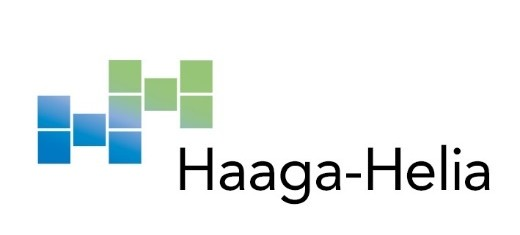

# Haaga-Helia pandoc/LaTeX document templates

{#fig:id}

This project's aim is to provide common [Haaga-Helia University of Applied Sciences](https://www.haaga-helia.fi/en) Microsoft Word document templates as [pandoc](https://pandoc.org/) LaTeX templates so that reports may be written in Markdown or LaTeX formats instead of Microsoft Office. At least the author prefers to do school assignments over processes and tools just like in the good ol' agile manifesto [@agilemanifesto2001]!

{#fig:id}

## Supported templates

Templates are intended to be as close to original templates as possible. Feel free to contribute with formatting improvements.

### Supported languages

Variable (in Markdown file YAML header): lang

* Finnish: fi-FI
* English: en-GB

### Supported templates

Variable: hhtemplatetype

* Short (SFS 2487) report template: [short](https://github.com/mrautio/hh-templates/blob/main/examples/README_short_english.pdf)
* Long report template: [long](https://github.com/mrautio/hh-templates/blob/main/examples/README_long_english.pdf)
* Thesis template: [thesis](https://github.com/mrautio/hh-templates/blob/main/examples/README_thesis_english.pdf)

### Arial font support

Haaga-Helia templates use Arial as the default font. It is a Microsoft proprietary font and not commonly available outside Windows and Office systems.

Docker image does not have Arial font installed. FreeSans is used as Docker image default font instead of Arial.
If you need Arial font outside Windows then at least Debian/Ubuntu has the font available in the package 'ttf-mscorefonts-installer'.

## Usage

This README file is an example that can be rendered to Haaga-Helia document template PDF, check the [raw file contents](https://github.com/mrautio/hh-templates/raw/main/README.md) for details.

### Markdown to PDF with Docker

Note: Container does not require networking unless you refer to Internet resources (like Internet URLs for images) in your reports. So as a best practice "--network none" is recommended to disable networking.

```sh
docker run --rm --network none --volume host-path-to-report-data:/report --tty mrautio/hh-templates --output /report/report.pdf /report/report.md --variable=hhtemplatetype:long
```

You can use [cosign](https://github.com/sigstore/cosign) to validate the container releases.

```sh
cosign verify -key cosign.pub mrautio/hh-templates
```

### Markdown to PDF with pandoc

Note: Filters are not mandatory but some features depend on them

```sh
pandoc --from markdown --template hhtemplate.tex --filter pandoc-tablenos --filter pandoc-fignos --filter pandoc-citeproc --filter pandoc-plantuml --pdf-engine=xelatex --listings --csl=https://www.zotero.org/styles/haaga-helia-university-of-applied-sciences-harvard -o report.pdf report.md --variable=hhtemplatetype:long
```

## Haaga-Helia reference Citation Style Language (CSL) configuration

Haaga-Helia reference style CSL configuration is available from [https://www.zotero.org/styles/haaga-helia-university-of-applied-sciences-harvard](https://www.zotero.org/styles/haaga-helia-university-of-applied-sciences-harvard). You can use the style with CSL supporting reference management software like Papers, RefWorks or Zotero.

## License

Templates/code/examples are released as public domain. Any **graphical assets** or other school's IPR belong to their corresponding copyright holders and are not covered by repository's license agreement.

# References
